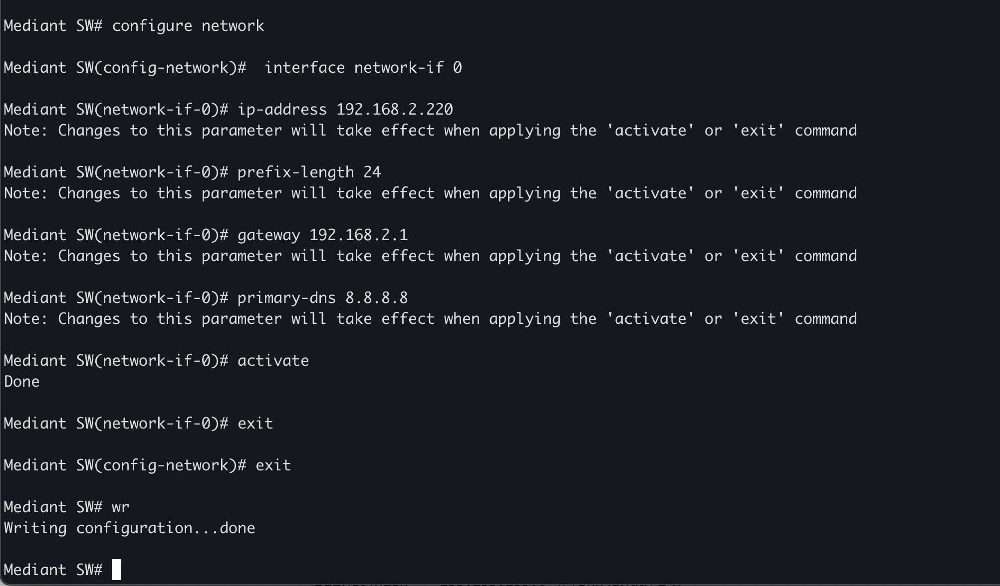

# 🛠️ How to Set a Static IP Address on AudioCodes Mediant via CLI

This guide explains how to configure a static IP address on an AudioCodes Mediant device using its Command Line Interface (CLI). This is particularly useful if you're working in a headless or console-only environment.

---

##  Default Login Credentials

To access the AudioCodes CLI:

- **Username**: `Admin`
- **Password**: `Admin`

When entering privileged EXEC mode with the `en` command, the password is also:

- **Enable Password**: `Admin`

---

##  Step-by-Step Configuration Guide

### 1. Enter Enable Mode

```bash
Mediant SW> en
Password: Admin
```


### 2. Navigate to Network Configuration

```bash
Mediant SW# configure network
```

### 3. Display the Existing Interface

```bash
Mediant SW(config-network)# interface network-if display
```

This shows current interface settings for interfaces like `network-if 0`.

### 4. Enter the Network Interface Configuration Mode

```bash
Mediant SW(config-network)# interface network-if 0
```

You’ll now be in the mode:  
`Mediant SW(network-if-0)#`

---

## Set Static IP Configuration

### 5. Configure the IP Address and Related Parameters

```bash
ip-address 192.168.2.220
prefix-length 24
gateway 192.168.2.1
primary-dns 8.8.8.8
```

> ⚠️ **Note**: You will see a message that changes take effect upon `activate` or `exit`.

---

### 6. Apply Changes

```bash
activate
```

You should see:
```bash
Done
```

### 7. Exit Configuration Mode

```bash
exit
```

---

##  Save the Configuration

```bash
Mediant SW# wr
Writing configuration...done
```



---


## 🖥️ Additional Tips

- Make sure the device is connected to the correct VLAN (`underlying-dev "vlan 1"` by default).
- You can verify settings anytime using:
  ```bash
  interface network-if display
  ```

---

